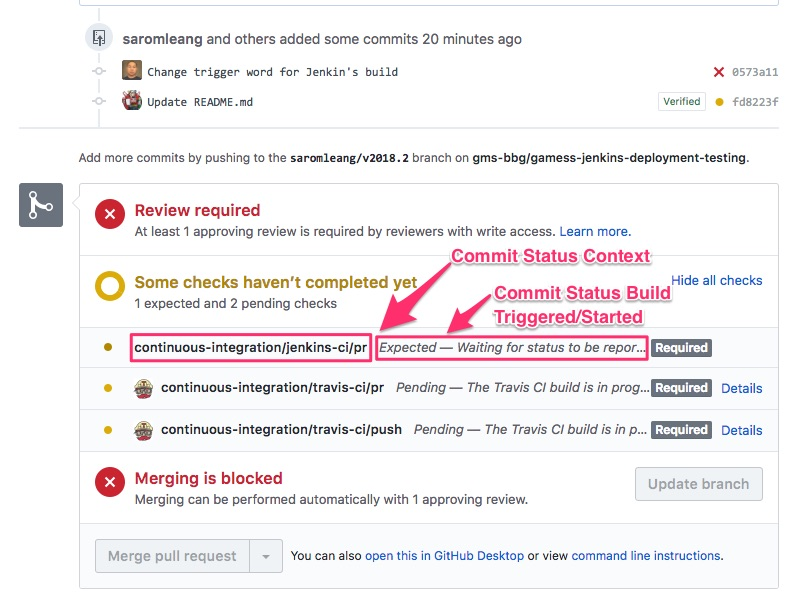

# Jenkins-CI Setup with GitHub
## Assumptions
*  The repository is private and is already integrated with Travis-CI.
*  Jenkins-CI server has a fully qualified domain name.
*  A dedicated `jenkins` users exists on the node hosting the Jenkins-CI server.
*  A dedicated account on GitHub exists for the Jenkins bot.
*  Centos 7 operating system.

## Installing Jenkins
### [Centos 7](https://wiki.jenkins.io/display/JENKINS/Installing+Jenkins+on+Red+Hat+distributions)
*  Install the LTS version of Jenkins:
    * `sudo wget -O /etc/yum.repos.d/jenkins.repo http://pkg.jenkins-ci.org/redhat-stable/jenkins.repo`
    * `sudo rpm --import https://jenkins-ci.org/redhat/jenkins-ci.org.key`
    * `sudo yum install jenkins`

*  Install Java:
    *  `sudo yum remove java`
    *  `yum install java-1.8.0-openjdk`

*  Configure firewall to permit either port 80 or port 8080
*  Check accessibility of the Jenkins-CI server:
    *  `http://hostname` or `http://hostname:8080`
*  Acquire adminitrator password: 
    *  `cat /var/lib/jenkins/secrets/initialAdminPassword`
    *  password may be stored in a different location

### [Ubuntu](https://wiki.jenkins.io/display/JENKINS/Installing+Jenkins+on+Ubuntu)
*  Click on above link.

## Install plugins
Navigate to: **Manage Jenkins** > **Manage Plugins**

*  [**Cobertura Plugin**](https://wiki.jenkins.io/display/JENKINS/Cobertura+Plugin) - for code coverage reporting
*  [**Conditional BuildStep**](https://wiki.jenkins-ci.org/display/JENKINS/Conditional+BuildStep+Plugin) - allows the specification of conditionals during the build step (if not all items of a matrix build should be built)
*  [**GitHub Authentication Plugin**](http://wiki.jenkins-ci.org/display/JENKINS/Github+OAuth+Plugin) - provides a means of using GitHub for authentication and authorization to secure Jenkins
*  [**GitHub Integration Plugin**](https://wiki.jenkins.io/display/JENKINS/GitHub+Integration+Plugin) - provides GitHub pull-request and branch triggers
*  [**GitHub Pull Request Builder**](https://wiki.jenkins.io/display/JENKINS/GitHub+pull+request+builder+plugin) - build pull-requests from GitHub and report results

## Configure GitHub Authentication Plugin
Navigate to: **Manage Jenkins** > **Configure Global Security**

*  Disable remember me [ ✓ ]
*  **Access Control** > **Security Realm**
    *  Select `Github Autentication Plugin`
        *  Create a GitHub application registration for Jenkins by accessing:
            *  [https://github.com/settings/applications/new](https://github.com/settings/applications/new)
	     *  Populate fields:
	         *  GitHub Web URI: `https://github.com`
	         *  GitHub API URI: `https://api.github.com`
	         *  Client ID: **{from the above step}**
	         *  Client Secret: **{from the above step}**
	         *  OAuth Scope(s): `read:org,user:email`
*  **Access Control** > **Authorization**
    *  Select `Matgrix-based security`
        *  Add users and/or groups and set the desired permissions
        *  Examples:
            *  GitHub username: `gamess`
            *  GitHub organization: `gms-bbg`
            *  GitHub group in an organization: `gms-bbg*jenkins`
*  Click on **Save**

## Configure GitHub Settings in Jenkins
Navigate to: **Manage Jenkins** > **Configure Configure System**

*  GitHub > GitHub Servers
    *  Click on the second **Advanced...** button:
        *  Click on **Manage additional GitHub actions**
            *  Select **Convert login and password to token**
            *  The UI will show **Convert login and password to token** options:
                * Select **From login and password**
                    *  Enter GitHub Login
                    *  Enter GitHub Password
                    *  Click on **Create token credentials**
                        *  Note the credential ID
    *  Reload the page proceed
*  GitHub > GitHub Servers
    *  Name: **{arbitrary name for GitHub server}**
    *  API URL: `https://api.github.com`
    *  Credentials: **{select the token you just generated}**
    *  Manage hooks [ ✓ ]
*  Click on **Save**

## Configure GitHub Pull Request Builder
Navigate to: **Manage Jenkins** > **Configure Configure System**

*  GitHub Pull Request Builder > 	GitHub Auth
    *  GitHub Server API URL: `https://api.github.com`
    *  Credentials: **{select auto generated token}***
    *  Description: **{provide an arbitrary name}**
    *  Auto-mange webhooks [ ✓ ]
    *  Admin list: **{supply a GitHub admin username}**
*  Click on **Save**

## Create a New Multi-configuration Project
*  Give the project a name
*  Select **Multi-configuration project**
*  Click on **OK**
*  General:
    *  [ ✓ ] Discard old builds
    *  [ ✓ ] GitHub project
        *  Project url: **URL for GitHub project**
            *  Example: **https://github.com/gms-bbg/gamess**
        *  Display name: **{provude an arbitrary name}**
*  Source Code Management:
    *  [ ✓ ] Git
        *  Repositories:
            *  Repository URL: **{provide repository URL used in `git clone` command}**
            *  Credentials: **{select or add credentials that is able to clone the above repository}**
            *  Click on **Advance**
                *  Name: `origin`
                *  Refspec: `+refs/pull/*:refs/remotes/origin/pr/*`
        *  Branches to build:
            *  Branch Specifier:  **{specify a branch name}**
                * *click on ( ? ) for more information*
*  Build Triggers
    *  GitHub Branches:
        *  Trigger Mode: `Hooks with Persisted Data`
        *  Set status before build [ ✓ ]
        *  Cancel queued builds [ ✓ ]
        *  Click on **Experimental**
            *  Repo providers:
                *  GitHub Plugin Repository Provider:
                *  Cache connection? [`  `]
                *  Manage hooks [ ✓ ]
                *  Repository requested permission: `PULL`
    *  GitHub Pull Request Builder:
        *  The fields `GitHub API credentials` and `Admin list` will be auto-populated
        *  Use github hooks for build triggering [ ✓ ]
        *  Click on **Advanced..**
            *  Crontab line: ` `
                *  *The Crontab line should be blank*
        *  Click on **Trigger Setup...**
            *  Click on **Add**
                *  Click on **Cancel build on update**
            *  Click on **Add**
                *  Click on **Update commit status during build**
                    *  Provide desired values for:
                        *  Commit Status Context
                        *  Commit Status Build Triggered
                        *  Commit Status Build Started
                    *  Add test result one liner [ ✓ ]

<div align="center"></div>

*  Configuration Matrix
    *  Define your build matrix
*  Build Environment
    *  [ ✓ ] Delete workspace before build starts
    *  [ ✓ ] Add timestamps to the Console Output
*  Build
    * **{Launch build script or build commands}**
*  Click on **Save**

## (Optional) Jenkins-CI Build/Test Triggering by Travis-CI

### Adding a "trigger phrase" (Jenkins-CI)

The following steps will add the use of a "trigger phrase" to initiate a Jenkins-CI build/test.  

*  Create or configure an existing job that utiltize the **GitHub Pull Request Builder**
*  Build Triggers
    *  GitHub Pull Request Builder:
        *  Click on **Advanced..**
            *  Trigger phrase: **{provide a phrase}**
            *  Only use trigger phrase for build triggering [ ✓ ]

### Personal access token for Travis-CI commenter (GitHub)

We will need to create a personal access token on GitHub to give Travis-CI the ability to comment a "trigger phrase" on a pull-request.

*  [https://github.com/settings/tokens](https://github.com/settings/tokens)
    *  Click on **Generate new token**
    *  Token description: `Travis-CI Commenter`
    *  Select scopes: `repo`
        *   Full control of private repositories
    *  Click on **Generate token**
    *  Note the personal access token for the next step

### Save personal access token on Travis-CI (Travis-CI)

We will store the personal access token created in the previous step in an environmental variable that will be accessbile to the Travis-CI worker.

*  Access the repository settings on Travis-CI:
    *  `https://travis-ci.com/{username or organization}/{repository name}/settings`
        *  Environmental Variables:
            *  Click on **Add**
                *  Name: `GITHUB_TOKEN`
                *  Value: **{personal access token created above}**

### Modify .travis.yml to comment "trigger phrase"  (GitHub)

Modify the `travis.yml` file and add to the `after_success:` section:

```yaml
after_success:
- path/to/shell/script/travis-ci-commenter.sh
```

Content of **travis-ci-commenter.sh** :

```bash
#!/bin/bash

if [ "$TRAVIS_PULL_REQUEST" != "false" ] ; then
    curl -H "Authorization: token ${GITHUB_TOKEN}" -X POST \
    -d "{\"body\": \"Omaha\"}" \
    "https://api.github.com/repos/${TRAVIS_REPO_SLUG}/issues/${TRAVIS_PULL_REQUEST}/comments"
```

Replace **Omaha** with the desired "trigger phrase".  
